# 安裝環境
* windows 10
* python 3.8.0

# 安裝步驟

## 1.下載python
網址:[Python](https://www.python.org/downloads/)

點擊Download
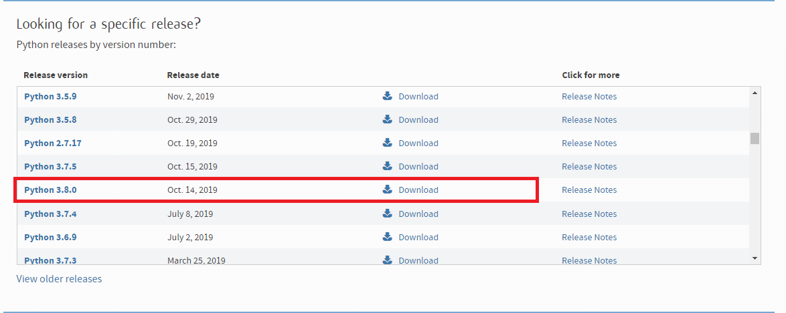

選擇windows的可執行安裝檔，目前大多都以64位元為主
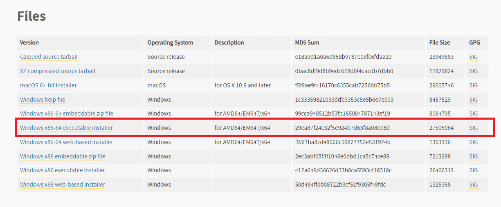

## 2.安裝過程
1. 
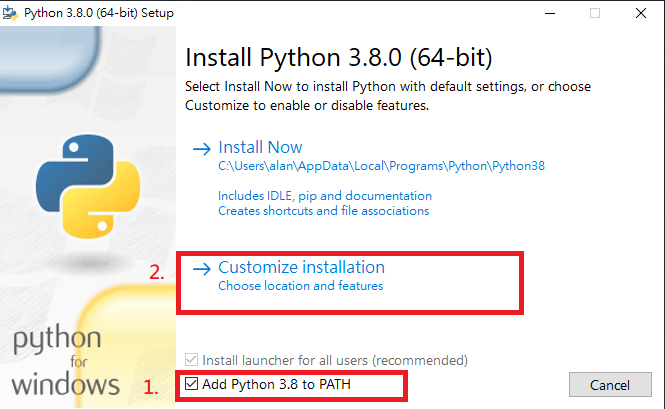

2.
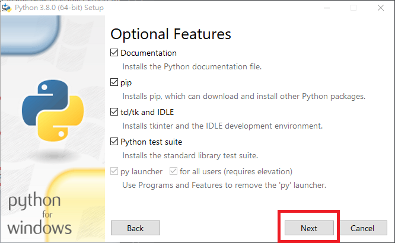

3.
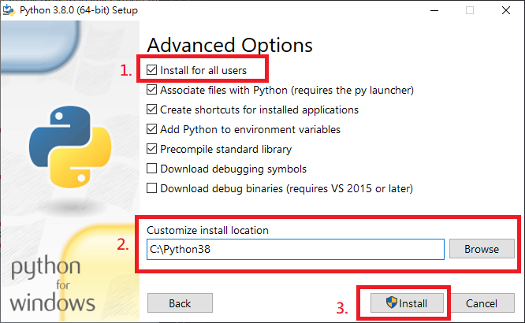

4.
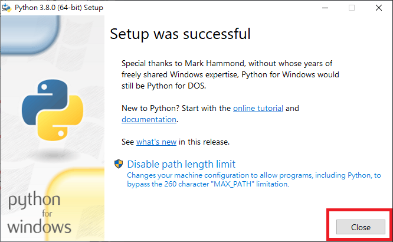

## 3.檢查環境
1.
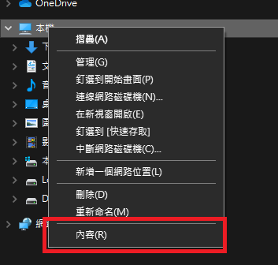

2.
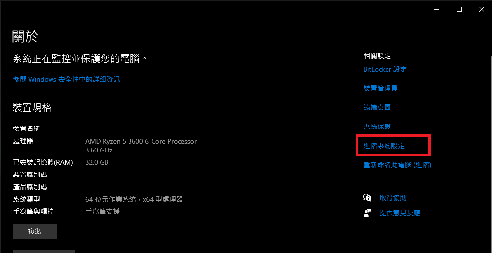

3.
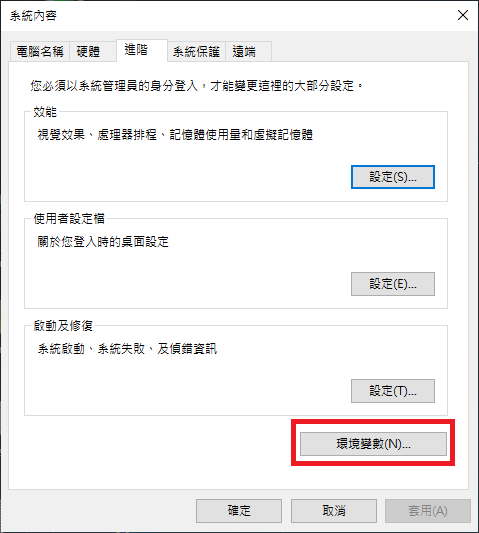

4.
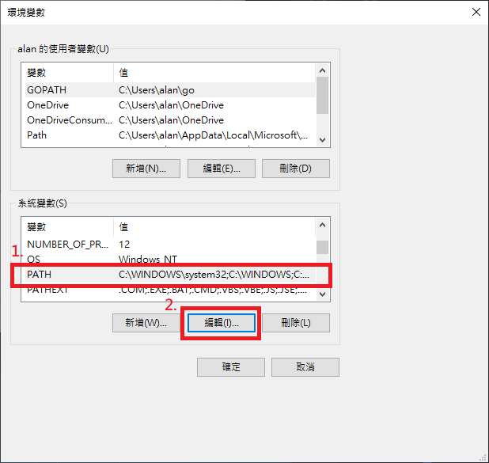

5.
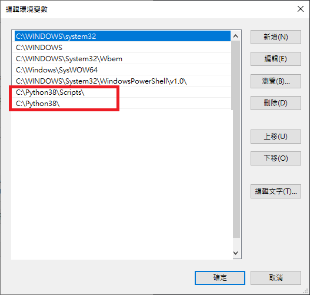

6.
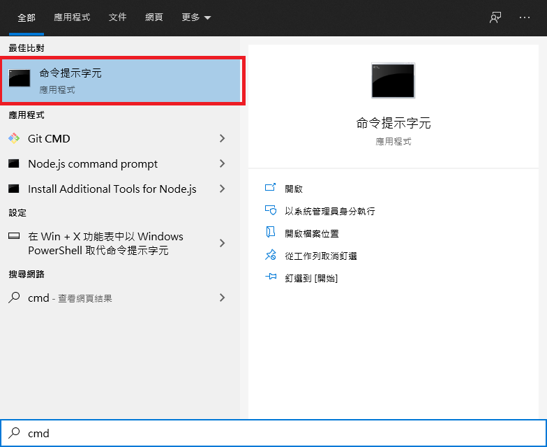

7.
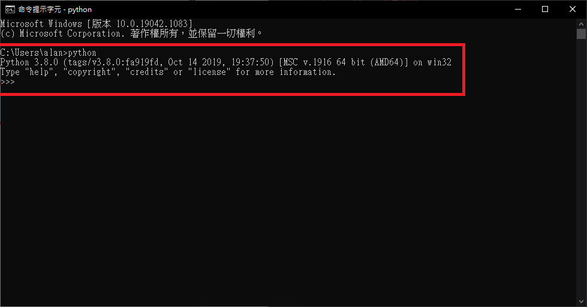